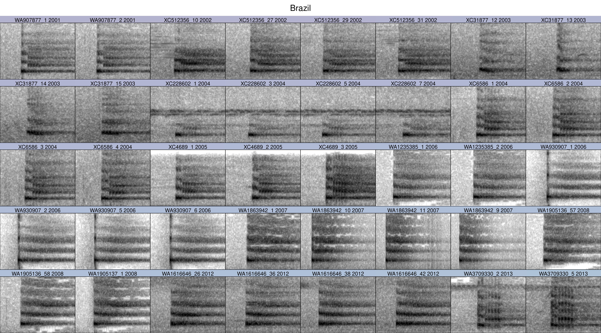
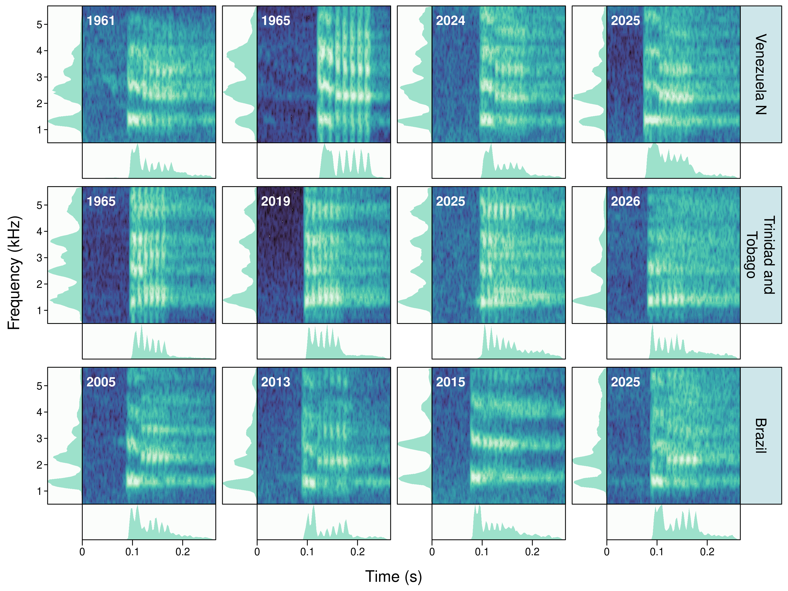

```{r set root directory}
#| eval: true
#| echo: false

# set working directory 
knitr::opts_knit$set(root.dir =  "..")

```

```{r add link to github repo}
#| eval: true
#| output: asis
#| echo: false

# print link to github repo if any
if (file.exists("./.git/config")){
  config <- readLines("./.git/config")
  url <- grep("url",  config, value = TRUE)
  url <- gsub("\\turl = |.git$", "", url)
  if (length(url) > 0 && nchar(url) > 1)
  cat("\nSource code and data found at [", url, "](", url, ")", sep = "")
  }

```

```{r setup style}
#| message: false
#| warning: false

# options to customize chunk outputs
knitr::opts_chunk$set(
  tidy.opts = list(width.cutoff = 65), 
  tidy = TRUE,
  message = FALSE
 )

```

<!-- skyblue box -->

::: {.alert .alert-warning}

This analysis serves as the animal-behavior-research case study accompanying the manuscript **"Obtaining nature media with the R package suwo"**, illustrating how suwo-retrieved media can be carried into a full downstream analytical pipeline

:::


::: {.alert .alert-info}
# Purpose {.unnumbered .unlisted}

-   Obtain and curate recordings of Bearded Bellbird (*Procnias averano*) and their associated metadata from multiple online repositories, using the R package `suwo`.

-   Quantify acoustic structure in Bearded Bellbird "bock" songs (Snow 1970).

-   Explore variation in "bock" songs and its covariation with time, geographic distance and population structure

:::


# Analysis flowchart {.unnumbered .unlisted}

```{mermaid}

flowchart LR
  A[Download data] --> B(Format data) 
  B --> C(Graphs)
  C --> D('MFCCs<br/>PCA')
  D --> E(Statistical model)

style A fill:#382A5433
style B fill:#395D9C33
style C fill:#3497A933
style D fill:#60CEAC33
style E fill:#60CEAC33

```

# Load packages {.unnumbered .unlisted}

```{r load packages}
#| eval: true
#| warning: false

# if sketchy not installed install it
if (!require("sketchy")) {
  install.packages("sketchy")
}

# install/ load packages

sketchy::load_packages(
  packages = c(
    "knitr",
    "warbleR",
    "Rraven",
    github = "maRce10/suwo",
    "ggplot2",
    "viridis",
    "ggtext",
    "brms",
    "geosphere",
    github = "maRce10/brmsish",
    "ggcorrplot",
    "ggdist",
    "posterior",
    "bayestestR",
    "geosphere",
    "logspline"
  )
)

```


# Custom functions

`broken_stick_k()` implements the PCA retention rule used in the pipeline below.

```{r}

## PC RETENTION: BROKEN-STICK MODEL (Frontier 1976; MacArthur 1957)

broken_stick_k <- function(X) {

  X    <- as.matrix(X)
  ev   <- prcomp(X, scale. = TRUE)$sdev^2
  p    <- length(ev)
  prop <- ev / sum(ev)

  # expected proportion for component k under random division of variance
  bs <- vapply(seq_len(p), function(k) sum(1 / (k:p)) / p, numeric(1))

  above      <- prop > bs
  first_fail <- which(!above)[1]
  k          <- if (is.na(first_fail)) p else first_fail - 1L

  list(k = max(1L, k), proportion = prop, expected = bs,
       cum_var = cumsum(prop))
}

## ============================================================
## build_dist_long(): construct the pairwise dataset from a selection
## table that already carries PC scores and SNR
## ============================================================
## Which INDIVIDUALS/RECORDINGS go in is controlled entirely by what's
## passed in as bock_est, not by any argument to this function itself.
##
## Assumes bock_est already has PC score columns (from PCA) and an SNR
## column (computed earlier in the pipeline) -- neither is recomputed
## here.
##
## Arguments:
##   bock_est  extended_selection_table with PC scores and SNR attached
##   pcs       character vector of PC column names (from pca_out$pcs)
##   out_file  optional path to saveRDS() the result to; NULL skips saving
##
## Returns: the pairwise dist_long data.frame.

build_dist_long <- function(bock_est, pcs, out_file = NULL) {

  ## ---- Aggregate by individual (mean PCs / SNR per orig.sound.files) --

  agg_pcs <- aggregate(bock_est[, pcs, drop = FALSE],
                        by  = list(orig.sound.files = bock_est$orig.sound.files),
                        FUN = mean)

  agg_snr <- aggregate(bock_est$SNR,
                        by  = list(orig.sound.files = bock_est$orig.sound.files),
                        FUN = mean)
  names(agg_snr)[ncol(agg_snr)] <- "SNR"

  agg_meta <- as.data.frame(bock_est[!duplicated(bock_est$orig.sound.files),
                      c("orig.sound.files", "population", "latitude", "longitude", "date")])

  agg_indiv <- merge(agg_pcs, agg_meta, by = "orig.sound.files")
  agg_indiv <- merge(agg_indiv, agg_snr, by = "orig.sound.files")
  rownames(agg_indiv) <- agg_indiv$orig.sound.files

  ## Convert explicitly to numeric BEFORE dist()
  agg_indiv$full_date <- as.Date(agg_indiv$date)

  ## Fractional years, not raw days: keeps this on the same "years" scale
  ## as every existing description of temporal separation in the
  ## manuscript, while replacing the coarse integer-year-difference with
  ## real day-level precision.
  agg_indiv$year_precise <- as.numeric(agg_indiv$full_date) / 365.25

  cat("Individuals going into this build:", nrow(agg_indiv), "\n")
  print(table(agg_indiv$population))

  ## ---- Pairwise distance matrices -------------------------------------

  dist_acoustic_mat <- as.matrix(dist(agg_indiv[, pcs, drop = FALSE], method = "euclidean"))

  coords       <- as.matrix(agg_indiv[, c("longitude", "latitude")])
  dist_geo_mat <- geosphere::distm(coords, fun = distHaversine) / 1000

  dist_time_mat <- as.matrix(dist(agg_indiv[, "year_precise", drop = FALSE], method = "euclidean"))

  ## pairwise minimum SNR: a pair's acoustic dissimilarity is corrupted by
  ## whichever of its two recordings is noisier, not by their average, so
  ## the predictor takes the pair's minimum rather than the pair's mean.
  snr_pair_mat <- outer(agg_indiv$SNR, agg_indiv$SNR, pmin)

  rownames(dist_acoustic_mat) <- colnames(dist_acoustic_mat) <- agg_indiv$orig.sound.files
  rownames(dist_geo_mat)      <- colnames(dist_geo_mat)      <- agg_indiv$orig.sound.files
  rownames(dist_time_mat)     <- colnames(dist_time_mat)     <- agg_indiv$orig.sound.files
  rownames(snr_pair_mat)      <- colnames(snr_pair_mat)      <- agg_indiv$orig.sound.files

  ## ---- Long format (upper triangle) -----------------------------------

  idx <- which(upper.tri(dist_acoustic_mat), arr.ind = TRUE)

  dist_long <- data.frame(
    individual1             = rownames(dist_acoustic_mat)[idx[, 1]],
    individual2             = colnames(dist_acoustic_mat)[idx[, 2]],
    acoustic_dissimilarity  = dist_acoustic_mat[idx],
    geo_distance            = dist_geo_mat[idx],
    time_separation         = dist_time_mat[idx],
    min_snr                 = snr_pair_mat[idx]
  )

  pop_lookup <- setNames(agg_indiv$population, agg_indiv$orig.sound.files)
  dist_long$population1 <- pop_lookup[dist_long$individual1]
  dist_long$population2 <- pop_lookup[dist_long$individual2]

  dist_long$same_population <- as.factor(as.integer(
    dist_long$population1 == dist_long$population2
  ))

  dist_long$individual1 <- factor(dist_long$individual1)
  dist_long$individual2 <- factor(dist_long$individual2)
  dist_long$population1 <- factor(dist_long$population1)
  dist_long$population2 <- factor(dist_long$population2)

  ## ---- Transformations and scaling -------------------------------------

  dist_long$acoustic_dissimilarity_sc <- scale(dist_long$acoustic_dissimilarity)[, 1]

  geo_const <- unname(quantile(dist_long$geo_distance, 0.25, na.rm = TRUE))
  dist_long$log_geo_distance <- log(dist_long$geo_distance + geo_const)

  ## Divide by 2 SD, not 1 SD (Gelman 2008): puts this continuous
  ## predictor's coefficient on the same "typical full swing" scale as
  ## the untouched binary same_population (0/1) predictor.
  dist_long$geo_distance_sc <- scale(dist_long$log_geo_distance)[, 1] / 2

  cat("geo_const (km):", signif(geo_const, 3),
      "| zero-distance pairs:", sum(dist_long$geo_distance == 0),
      "(", round(100 * mean(dist_long$geo_distance == 0), 1), "% )\n")

  dist_long$time_separation_sc <- scale(dist_long$time_separation)[, 1] / 2

  ## 2-SD scaled, not log-transformed: unlike geographic distance, min_snr
  ## (dB) has no comparable right-skew / zero-mass issue -- revisit if
  ## skewed once inspected.
  dist_long$min_snr_sc <- scale(dist_long$min_snr)[, 1] / 2

  ## ---- Filter to complete cases -----------------------------------------

  model_vars <- c("acoustic_dissimilarity_sc", "same_population",
                  "geo_distance_sc", "time_separation_sc", "min_snr_sc",
                  "population1", "population2",
                  "individual1", "individual2")

  n_before <- nrow(dist_long)
  dist_long <- dist_long[complete.cases(dist_long[, model_vars]), ]
  n_after  <- nrow(dist_long)

  if (n_after < n_before) {
    cat("rows dropped due to NAs:", n_before - n_after,
        "of", n_before, "(", round(100 * (n_before - n_after) / n_before, 1), "% )\n")
  }

  ## mm(individual1, individual2) and mm(population1, population2) require
  ## both columns of each pair to share exactly the same set of levels.

  individual_levels <- union(as.character(dist_long$individual1),
                              as.character(dist_long$individual2))
  dist_long$individual1 <- factor(as.character(dist_long$individual1), levels = individual_levels)
  dist_long$individual2 <- factor(as.character(dist_long$individual2), levels = individual_levels)

  population_levels <- union(as.character(dist_long$population1),
                              as.character(dist_long$population2))
  dist_long$population1 <- factor(as.character(dist_long$population1), levels = population_levels)
  dist_long$population2 <- factor(as.character(dist_long$population2), levels = population_levels)

  dist_long$same_population <- droplevels(dist_long$same_population)

  cat("Final pairs in this build:", nrow(dist_long), "\n\n")

  if (!is.null(out_file)) saveRDS(dist_long, out_file)

  dist_long
}

```

# Obtain recordings

::: {.alert .alert-info}
Raw audio files are **not** included in this repository (they are large and fully reproducible). To replicate the analysis, choose one of the following:

-   **Use the pre-built extended selection table (recommended)**: `data/processed/p_averano_bock_extended_selection_table.rds` already embeds the annotated "bock" song clips, so you can skip straight to the [Remove low SNR songs](#remove-low-snr-songs) section below without downloading anything.
-   **Download the recordings yourself**: run the chunks below (set `eval: true`) to re-query and re-download the dataset from the five repositories via `suwo`, then re-run the annotation-curation and selection-table-building chunks that follow.
:::

The following code queries and downloads all available Bearded Bellbird recordings from 5 repositories:
```{r}
#| eval: false

# search species

# time process
init_time <- Sys.time()
options(suwo_species = "Procnias averano", suwo_format = "sound")
mac <- query_macaulay(path = tempdir())
xc <- query_xenocanto()
wa <- query_wikiaves()
inat <- query_inaturalist()
gbif <- query_gbif()
end_time <- Sys.time()

dura <- end_time - init_time


# merge data
dat <- merge_metadata(wa, inat, gbif, xc, mac)

# find duplicates and exclude them
dat <- find_duplicates(dat)

dedup_dat <- remove_duplicates(dat)


#  download all files first
dm <- download_media(dedup_dat, path = "./data/raw/p_averano_recordings", cores = 10)

# save metadata
write.csv(dm, "./data/processed/p_averano_recordings_metadata.csv", row.names = FALSE)

# collect acoustic features and standardize file format on the downloaded recordings
ohun::feature_acoustic_data(path = "./data/raw/p_averano_recordings")

warbleR::fix_wavs(path = "./data/raw/p_averano_recordings")

# now look again for duplicates using file size and user name as criteria, and remove them
dm <- find_duplicates(metadata = dm, criteria = paste("user_name > 0.7", "file_size > 0.99", sep = " & "))

dedup_dm <- remove_duplicates(dm)

dm <- download_media(dedup_dat, path = "./data/raw/p_averano_recordings", cores = 10)

dedup_dm <- dm[!duplicated(dm$duplicate_group) | is.na(dm$duplicate_group), ]

duplicates <- list.files("./data/raw/p_averano_recordings")[!list.files("./data/raw/p_averano_recordings") %in% dedup_dm$downloaded_file_name]

unlink(file.path("./data/raw/p_averano_recordings", duplicates))

dedup_dm <- download_media(dedup_dm, path = "./data/raw/p_averano_recordings", cores = 23)


write.csv(dedup_dm, "./data/processed/p_averano_recordings_metadata.csv", row.names = FALSE)

```


# Curate annotations

```{r curate annotations}
#| eval: false

txts <- list.files("/home/m/Insync/marceloa27@gmail.com/Google Drive/grabaciones_para_ordenar/Anotaciones/Selecciones/", full.names = TRUE)

# file.copy(from = txts, to = "./data/raw/p_averano_annotations/", overwrite = TRUE)

anns <- imp_raven(path = "./data/raw/p_averano_annotations/", warbler.format = TRUE, name.from.file = TRUE, ext.case = "lower", all.data = TRUE)
ncol(anns)

anns$sound.files <- NULL


sfs <- gsub(".Band.Limited.Energy.Detector.wav|.Table1.wav", ".wav", anns$sound.files)
anns$sound.files <- sfs

# head(anns)

anns <- check_sels(anns, path = "./data/raw/p_averano_recordings", fix.selec = TRUE)


```

```{r add metadata}
#| eval: false

metadata <- read.csv("./data/processed/p_averano_recordings_metadata.csv", stringsAsFactors = FALSE)

metadata <- metadata[!is.na(metadata$downloaded_file_name), ]

# convert all to .wav
metadata$downloaded_file_name <- gsub(".mp3$|.m4a$", ".wav", metadata$downloaded_file_name)


# all(unique(anns$sound.files) %in% metadata$downloaded_file_name)


metadata <- metadata[metadata$downloaded_file_name %in% unique(anns$sound.files), ]

metadata$type <- sapply(metadata$downloaded_file_name, function(x){
    
    out <- paste(unique(na.omit(anns$Tipo[anns$sound.files == x])), collapse = "-")
    
    if (length(out) == 0) {
      out <- NA
    }
    
    return(out)
})


# add lat lon
localidades <- data.frame(
  archivo = c(
    "Cumaca Valley",
    "Jaqueira/PE",
    "Guaramiranga/CE",
    "Pacatuba/CE",
    "Maranguape/CE",
    "São Luís/MA",
    "Caxias/MA",
    "FORA DO BRASIL/EX",
    "Dianópolis/TO",
    "Araguaína/TO",
    "Fazenda Nazaret, estado do Piauí"
  ),
  Latitude = c(
    10.7000,     # Cumaca Valley, Trinidad y Tobago
    -8.9967,     # Jaqueira/PE
    -4.2725,     # Guaramiranga/CE
    -3.9822,     # Pacatuba/CE
    -3.8908,     # Maranguape/CE
    -2.5297,     # São Luís/MA
    -4.8592,     # Caxias/MA
    NA,          # FORA DO BRASIL/EX - no es una localidad real
    -11.6236,    # Dianópolis/TO
    -7.1911,     # Araguaína/TO
    -9.3353      # Fazenda Nazaré, PI (confianza media)
  ),
  Longitude = c(
    -61.1500,
    -35.7014,
    -38.9328,
    -38.6206,
    -38.6844,
    -44.3028,
    -43.3567,
    NA,
    -46.8228,
    -48.2072,
    -45.5725
  )
)

for (i in which(is.na(metadata$latitude))){
    
metadata$latitude[i] <- localidades$Latitude[localidades$archivo == metadata$locality[i]]

metadata$longitude[i] <- localidades$Longitude[localidades$archivo == metadata$locality[i]]    

}


metadata$population <- "non_class"

# brazil population
metadata$population <- ifelse(grepl("razil", metadata$country) & is.na(metadata$longitude), "Brazil", metadata$population)
metadata$population <- ifelse(metadata$latitude <= -1.407 & metadata$longitude < -2.63, "Brazil", metadata$population)


# trinidad and tobago
metadata$population <- ifelse(grepl("rinidad", metadata$country), "Trinidad and Tobago", metadata$population)
metadata$population <- ifelse(metadata$latitude > 9.67 & metadata$longitude > -62.01 & metadata$population == "non_class", "Trinidad and Tobago", metadata$population)

# venezuela SE
metadata$population <- ifelse(grepl("non_class", metadata$population) & metadata$latitude <  7.56, "Venezuela SE", metadata$population)

# venezuela SE
metadata$population <- ifelse(grepl("non_class", metadata$population) & metadata$latitude >  7.56, "Venezuela N", metadata$population)

# refill brazil
metadata$population <- ifelse(is.na(metadata$population) & metadata$country ==  "Brazil", "Brazil", metadata$population)


anns$population <- sapply(anns$sound.files, function(x){
  pop <- metadata$population[metadata$downloaded_file_name == x]
  if (length(pop) == 0) {
    pop <- NA
  }
  return(pop)
})

table(anns$population, anns$Tipo)

anns$latitude <- sapply(anns$sound.files, function(x){
  lat <- metadata$latitude[metadata$downloaded_file_name == x]
  if (length(lat) == 0) {
    lat <- NA
  }
  return(lat)
})

anns$longitude <- sapply(anns$sound.files, function(x){
  lon <- metadata$longitude[metadata$downloaded_file_name == x]
  if (length(lon) == 0) {
    lon <- NA
  }
  return(lon)
})

anns$locality <- sapply(anns$sound.files, function(x){
  loc <- metadata$locality[metadata$downloaded_file_name == x]
  if (length(loc) == 0) {
    loc <- NA
  }
  return(loc)
})

anns$year <- sapply(anns$sound.files, function(x){
  yr <- metadata$date[metadata$downloaded_file_name == x]
  yr <- substring(yr, 1, 4)
  
  if (length(yr) == 0) {
    yr <- NA
  }
  return(yr)
})

anns$date <- sapply(anns$sound.files, function(x){
  dt <- metadata$date[metadata$downloaded_file_name == x]
  if (length(dt) == 0) {
    dt <- NA
  }
  return(dt)
})

# unique(anns$locality[is.na(anns$latitude)])

# remove those without a date
anns <- anns[!is.na(anns$date), ]

est <- selection_table(anns, path = "./data/raw/p_averano_recordings", extended = TRUE)

est$year <-  anns$year
est$date <-  anns$date

est$orig.sound.files <- attr(est, "check.res")$orig.sound.files

attr(est, "metadata") <- metadata

saveRDS(est, "./data/processed/p_averano_extended_selection_table.rds")

bock_est <- est[est$Tipo == 1, ]

bock_est$Tipo <- NULL

# measure SNR
bock_est <- sig2noise(bock_est, mar = 0.05,
                     bp = c(min(bock_est$bottom.freq), max(bock_est$top.freq)))


attr(bock_est, "metadata") <- metadata[metadata$downloaded_file_name %in% bock_est$orig.sound.files, ]

saveRDS(bock_est, "./data/processed/p_averano_bock_extended_selection_table.rds")

```


# Remove low SNR songs

Exclude songs with SNR < 1, which are likely to be too noisy to provide reliable acoustic measurements.
```{r}
#| eval: true

bock_est <- readRDS("./data/processed/p_averano_bock_extended_selection_table.rds")

bock_metadata <- attr(bock_est, "metadata")

# make ggplot histogram
ggplot(bock_est, aes(x = SNR)) +
  geom_histogram(bins = 50, fill = viridis::mako(10, alpha = 0.5)[2], color = "black") +
  labs(x = "Signal-to-noise ratio (dB)", y = "Count") +
geom_vline(xintercept = 1, color = "red", linetype = "dashed") +
  theme_classic()

```

`r sum(bock_est$SNR < 1)` out of `r nrow(bock_est)` songs have SNR < 1 and were excluded from the analysis.

```{r}

bock_est <- bock_est[bock_est$SNR >= 1, ]

```

# Keep the highest SNR per recording

```{r}
## ============================================================
## CAP SELECTIONS PER RECORDING (keep up to 5 highest-SNR songs)
## ============================================================
## A recording with many annotated songs would otherwise dominate that
## individual's mean PC/SNR values relative to a recording with only one
## or two -- capping at the 5 best-SNR selections keeps every recording's
## contribution to the per-individual average roughly comparable, while
## still preferring its cleanest songs over noisier ones from the same
## recording. Computed on plain vectors (ave/rank), then applied as a
## single row-index subset -- not split()/rbind() -- since this is the
## indexing form already established to preserve extended_selection_table
## attributes correctly (see fix_extended_selection_table() in the PCA
## chunk).

snr_rank_in_recording <- ave(-bock_est$SNR, bock_est$orig.sound.files,
                              FUN = function(x) rank(x, ties.method = "first"))

n_recordings_capped <- sum(table(bock_est$orig.sound.files) > 5)
n_selections_before <- nrow(bock_est)

bock_est <- bock_est[snr_rank_in_recording <= 5, ]

cat("Recordings with >5 songs (capped):", n_recordings_capped, "\n")
cat("Selections before cap:", n_selections_before,
    "| after cap:", nrow(bock_est), "\n")

```


# Remove possible duplicated recordings from the same individual

Recordings were screened for likely duplicates of the same individual before principal component analysis:

* Recordings made within 1 km and within 7 days of one another were flagged as possible duplicates (for example, a territorial male re-recorded on a later visit to the same lek or perch), to avoid treating repeat recordings of one bird as independent individuals in the pairwise dataset.
* Distances and date separations were computed independently within each of the four populations rather than across the full dataset, since two recordings from different allopatric populations can never represent the same individual.
* Recordings linked by chains of pairwise matches (e.g. three recordings in close succession at one site, where the first and third do not themselves meet the criteria but each links through the second) were grouped as a single set of potential duplicates. Only the highest-mean-SNR recording was retained from each group; the rest, and their selections, were excluded.
* This is distinct from the pairwise minimum-SNR covariate used later in the statistical model: here SNR chooses among recordings believed to represent the same individual, whereas the covariate accounts for residual recording-quality variation among the individuals that remain.
* This procedure identified 19 groups of two or more recordings (43 of 115 total recordings), reducing the retained recordings from 115 to 91. The two largest groups (four and five recordings) were inspected manually and confirmed to be genuine repeat recordings of the same individual rather than multiple individuals recorded in close proximity.

```{r}

## Recordings within km_threshold km and week_threshold days of each
## other are treated as repeat recordings of the same bird (e.g. a
## territorial male re-recorded on a later visit to the same lek/perch),
## rather than independent individuals. Distances are computed WITHIN
## each population separately, never across populations -- both cheaper
## than one large cross-population distance matrix, and correct, since
## two recordings from different allopatric populations can never be the
## same individual regardless of any coordinate arithmetic.
##
## Chains of recordings that consecutively meet the criteria (A-B, B-C)
## are grouped together even if A and C do not themselves meet the
## criteria, as long as each links through an intermediate recording.
## Only the highest-SNR recording is kept from each group.

km_threshold   <- 1    # km
week_threshold <- 7    # days


## one row per recording, with its location, date, population, and mean
## SNR across its selections -- used only to decide which RECORDINGS to
## keep
rec_meta <- bock_est[!duplicated(bock_est$orig.sound.files),
                      c("orig.sound.files", "population",
                        "latitude", "longitude", "date")]
rec_meta$full_date <- as.Date(rec_meta[["date"]])

rec_snr <- aggregate(bock_est$SNR,
                      by  = list(orig.sound.files = bock_est$orig.sound.files),
                      FUN = mean)
names(rec_snr)[2] <- "SNR"

rec_meta <- merge(rec_meta, rec_snr, by = "orig.sound.files")

## connected components via a small base-R union-find: chains of
## recordings that consecutively meet the criteria collapse into one
## group even if the first and last don't meet the criteria directly.
union_find_components <- function(n, edges) {
  parent <- seq_len(n)

  find <- function(x, parent) {
    while (parent[x] != x) x <- parent[x]
    x
  }

  for (i in seq_len(nrow(edges))) {
    ra <- find(edges[i, 1], parent)
    rb <- find(edges[i, 2], parent)
    if (ra != rb) parent[ra] <- rb
  }

  sapply(seq_len(n), find, parent = parent)
}

## ---- loop over population: pairwise distances computed within each ----
## population only, never across populations

rec_meta$dup_group <- NA_character_

for (pop in unique(rec_meta$population)) {

  pop_idx <- which(rec_meta$population == pop)
  pop_sub <- rec_meta[pop_idx, ]
  n_pop   <- nrow(pop_sub)

  if (n_pop > 1) {
    coords_pop <- as.matrix(pop_sub[, c("longitude", "latitude")])
    geo_km_pop <- geosphere::distm(coords_pop, fun = distHaversine) / 1000
    days_pop   <- as.matrix(dist(as.numeric(pop_sub$full_date)))

    idx_dup_pop <- which(geo_km_pop <= km_threshold & days_pop <= week_threshold &
                            upper.tri(geo_km_pop), arr.ind = TRUE)

    local_group <- union_find_components(n_pop, idx_dup_pop)
  } else {
    local_group <- 1L
  }

  ## prefix with population name so group IDs are globally unique once
  ## every population's results are combined back into one table
  rec_meta$dup_group[pop_idx] <- paste(pop, local_group, sep = "_")
}

## sanity check before collapsing: how many recordings are affected, and
## does any group span an implausibly long date range (a sign of
## chaining rather than genuine same-individual repeats)?
group_sizes <- table(rec_meta$dup_group)
cat("Groups with >1 recording:", sum(group_sizes > 1),
    "| recordings affected:", sum(group_sizes[group_sizes > 1]), "\n")

group_span <- aggregate(full_date ~ dup_group, data = rec_meta,
                         FUN = function(x) as.numeric(diff(range(x))))
print(group_span[group_span$full_date > week_threshold, ])   # inspect any of these

## select the highest-SNR recording from each pool of potential duplicates
rec_meta <- rec_meta[order(-rec_meta$SNR), ]
recordings_to_keep <- rec_meta$orig.sound.files[!duplicated(rec_meta$dup_group)]

n_before_dedup <- length(unique(bock_est$orig.sound.files))
bock_est <- bock_est[bock_est$orig.sound.files %in% recordings_to_keep, ]

attr(bock_est, "metadata") <- bock_metadata[bock_metadata$downloaded_file_name %in% bock_est$orig.sound.files, ]

cat("Recordings before dedup:", n_before_dedup,
    "| after dedup:", length(unique(bock_est$orig.sound.files)), "\n")
```


# Map locations

```{r add metadata 2}


map_metadata <- attr(bock_est, "metadata")

map_plot <- map_locations(
  map_metadata,
  tags = c("latitude", "longitude", "population"),
  by = "population",
  palette = function(n) viridis::mako(n, begin = 0.2, end = 0.75)
)

## map_locations() auto-fits the view tightly to the data, so the
## minimap inset (bottom-right, 150x150px, no position argument
## exposed) ends up covering real points -- every other corner is
## already taken by another control (zoom top-left, the custom
## "Popups" toggle top-right, the scale bar bottom-left). Re-fitting
## with reserved bottom-right padding makes the auto-fit zoom out just
## enough that no point falls under the minimap, instead of removing it.
map_plot <- leaflet::fitBounds(
  map_plot,
  lng1 = min(map_metadata$longitude, na.rm = TRUE),
  lat1 = min(map_metadata$latitude, na.rm = TRUE),
  lng2 = max(map_metadata$longitude, na.rm = TRUE),
  lat2 = max(map_metadata$latitude, na.rm = TRUE),
  options = list(paddingBottomRight = c(40, 40))
)

map_plot

```

# Principal component analysis

* Acoustic structure for "bock" songs was summarized with a set of MFCC-derived statistics (`mfcc_stats()`, `warbleR`) computed over the frequency band spanned by the annotated selections, its bounds taken as the lowest and highest frequency limits across all annotation boxes in the dataset, then reduced with a principal component analysis (PCA) on the standardized statistics.
* MFCCs were used because they summarize the overall spectral envelope rather than tracking individual frequency components, making them well suited to the harmonically rich structure of "bock" songs, in which energy is distributed across multiple harmonics.
* Pairwise Euclidean distance between individuals in this reduced space is the acoustic-distance response used in the model below, so the number of components retained determines what the response variable *is*, not just how it is summarized.
* Because PCA is an orthonormal rotation, truncating to fewer components is a deliberate low-rank *denoising* step (Eckart and Young 1936): components beyond some point are assumed to carry more measurement noise than acoustic signal, and dropping them removes that noise from the response.
* Components were retained using the broken-stick model: each component's *observed* proportion of variance is compared against the proportion it would be expected to carry if the total variance were divided at random among all components, and a component is retained only until the first one that fails to clear that expectation.
* This was the best-performing stopping rule in Jackson's (1993, *Ecology* 74:2204–2214) simulation comparison across ecological datasets, and it is the conservative choice for this analysis: acoustic dissimilarity is the model's **response** variable rather than a predictor, so every additional noise component retained widens posterior intervals and reduces power to detect genuine geographic or temporal structure downstream.

```{r pca bock songs}
#| eval: false

## ---- PCA on standardized MFCC statistics --------------------------------

## band taken from the annotations themselves, on both ends, so it matches
## the band already used for sig2noise() upstream
mfcc_tp   <- mfcc_stats(bock_est, bp = c(min(bock_est$bottom.freq), max(bock_est$top.freq)))
mfcc_feat <- mfcc_tp[, c(-1, -2)]

pca_tp  <- prcomp(mfcc_feat, scale. = TRUE)
cum_var <- summary(pca_tp)$importance[3, ]

## PC retention via the broken-stick rule
n_pcs <- broken_stick_k(mfcc_feat)$k

pcs <- paste0("PC", seq_len(n_pcs))
pc_scores <- as.data.frame(pca_tp$x[, seq_len(n_pcs), drop = FALSE])
colnames(pc_scores) <- pcs

## fix_extended_selection_table() re-attaches proper extended_selection_table
## attributes/wave-object references after cbind() adds plain columns --
## needed so downstream functions that expect a genuine extended_selection_
## table (e.g. sig2noise(), single-bracket subsetting) keep working
## correctly.
bock_est2 <- bock_est
bock_est  <- cbind(bock_est, pc_scores)
bock_est  <- fix_extended_selection_table(X = bock_est, Y = bock_est2)

## saved so the PCA never needs to be recomputed downstream: the
## diagnostic section below and the Model fitting section both read
## this file rather than re-running mfcc_stats()/prcomp() a second and
## third time (which previously risked the two silently drifting apart).
saveRDS(list(
  bock_est     = bock_est,
  pcs        = pcs,
  n_pcs      = n_pcs,
 cum_var    = cum_var
), "./data/processed/pca_bock_broken_stick.rds")
```

```{r}
pca_out    <- readRDS("./data/processed/pca_bock_broken_stick.rds")
```


* The first `r pca_out$n_pcs` principal components were retained, together explaining `r round(pca_out$cum_var[pca_out$n_pcs] * 100, 1)`% of the variance in the standardized MFCC statistics.
* These components are used to compute pairwise Euclidean distances between individuals, the acoustic-distance response variable used in the model below.

# Check distances

* Before fitting the model, the pairwise predictors are inspected directly: the shape of the geographic-distance distribution (including how zero-distance pairs created by shared-locality coordinates are handled), and the correlation structure among predictors, particularly between `same_population` and `geo_distance_sc`, and between `time_separation` and geographic distance.
* These checks motivate two choices used throughout the modeling pipeline below: the log-transform and additive constant applied to geographic distance, and the decision to include `same_population` and `geo_distance_sc` together in the same model despite their moderate correlation.

```{r}

bock_est   <- pca_out$bock_est
pcs        <- pca_out$pcs
n_pcs      <- pca_out$n_pcs
cum_var    <- pca_out$cum_var

## PCA recap -- printed here, immediately before any regression model is
## fitted (full detail is in the "Principal component analysis" section).
cat("==== PCA recap ====\n")
cat("PCs retained:", n_pcs, "| cumulative variance explained:",
    round(cum_var[n_pcs] * 100, 1), "%\n\n")

## SNR was already measured earlier in the pipeline -- bock_est already
## carries an SNR column at this point (see the SNR-filtering step
## upstream, before PCA), so it is not recomputed here.

## build_dist_long() (defined once, in Custom functions) encapsulates
## aggregation by individual, all pairwise distances, transformations,
## 2-SD scaling, and NA filtering -- see its definition for the full
## step-by-step logic.

dist_long <- build_dist_long(bock_est, pcs,
                              out_file = "./data/processed/dist_long_bock.rds")
```

## Data description
```{r}

dist_long  <- readRDS("./data/processed/dist_long_bock.rds")

dist_long$geo_km_adj <- exp(dist_long$log_geo_distance)
dist_long$acoustic_prop <- dist_long$acoustic_dissimilarity / max(dist_long$acoustic_dissimilarity, na.rm = TRUE)

ggplot(dist_long, aes(x = geo_km_adj, fill = same_population)) +
  geom_histogram(bins = 50, position = "identity", alpha = 0.6) +
  scale_x_log10() +
  scale_fill_viridis_d(begin = 0.2, end = 0.75,
                       labels = c("Different", "Same")) +
  labs(x = "Geographic distance (km, log scale)", y = "Number of pairs",
       fill = "Population") +
  theme_classic()
```


```{r}

sp <- as.numeric(as.character(dist_long$same_population))
minpos <- min(dist_long$geo_distance[dist_long$geo_distance > 0], na.rm = TRUE)

cat("pairs:", nrow(dist_long), "| individuals:",
    length(unique(c(as.character(dist_long$individual1), as.character(dist_long$individual2)))), "\n")
cat("geo_distance == 0:", sum(dist_long$geo_distance == 0),
    "(", round(100 * mean(dist_long$geo_distance == 0), 1), "% )\n")
cat("log_geo range:", round(range(dist_long$log_geo_distance), 2), "\n")
cat("pairs in 100-1000 km gap:",
    sum(dist_long$geo_distance > 100 & dist_long$geo_distance < 1000),
    "(", round(100 * mean(dist_long$geo_distance > 100 & dist_long$geo_distance < 1000), 1), "% )\n")
cat("cor(log_geo, same_population):",
    round(cor(dist_long$log_geo_distance, sp), 3), "\n")
cat("cor(time_separation, log_geo):",
    round(cor(dist_long$time_separation, dist_long$log_geo_distance), 3), "\n")

pos <- dist_long$geo_distance[dist_long$geo_distance > 0]
consts <- c(min(pos)/10, min(pos), quantile(dist_long$geo_distance, 0.25), 1)
names(consts) <- c("min/10 (previous)", "min", "P25 (HH20, used)", "1 km")

n_pairs <- nrow(dist_long)
n_indiv <- length(unique(c(as.character(dist_long$individual1),
                           as.character(dist_long$individual2))))

```

* The pairwise dataset comprised `r n_pairs` comparisons among `r n_indiv` individuals.

## Check for collinearity

Collinearity among all predictors

```{r}
pred_vars <- c("min_snr_sc", "same_population", "time_separation_sc", "geo_distance_sc")

pred_df <- dist_long[, pred_vars]
pred_df$same_population <- as.numeric(as.character(pred_df$same_population))

corr_mat <- cor(pred_df, use = "pairwise.complete.obs")

cols <- mako(10, alpha = 0.8, begin = 0.2, end = 0.75)

ggcorrplot(corr_mat, type = "lower", lab = TRUE, lab_size = 4,
           colors = c(cols[1], "white", cols[10]),
           title = "Pairwise predictor correlations")

```


* Variance inflation factors (VIFs) were computed for the fixed effects in the model to check for collinearity.
* Interpreted as: below 5, low concern; 5 to 10, moderate concern; above 10, high concern.
* All VIFs fall below 5, so collinearity is not a major concern for the predictors in this model.

```{r}

vif_mod <- lm(acoustic_dissimilarity_sc ~ min_snr_sc + same_population +
                time_separation_sc + geo_distance_sc,
              data = dist_long)

vif_vals <- car::vif(vif_mod)
vif_df <- data.frame(term = names(vif_vals), vif = as.numeric(vif_vals))

## conventional rule-of-thumb thresholds: <5 low concern, 5-10 moderate,
## >10 high. Some fields use stricter cutoffs (2.5 / 4); doesn't matter
## for your numbers specifically, since ~1.7-2.2 clears either convention.
vif_df$severity <- cut(vif_df$vif, breaks = c(0, 5, 10, Inf),
                        labels = c("low", "moderate", "high"))

ggplot(vif_df, aes(x = vif, y = reorder(term, vif), color = severity)) +
  geom_vline(xintercept = c(5, 10), linetype = "dashed", color = "grey60") +
  geom_segment(aes(x = 1, xend = vif, yend = term), linewidth = 1) +
  geom_point(size = 3) +
  scale_color_manual(values = c(low = cols[1], moderate = "orange", high = cols[10])) +
  labs(x = "Variance Inflation Factor", y = NULL, color = "Collinearity") +
  theme_minimal(base_size = 13)

```


```{r}
## agg_indiv is local to build_dist_long() and not available here, so a
## lightweight per-individual aggregation is recomputed directly from
## bock_est for this check alone.

agg_snr_check <- aggregate(bock_est$SNR,
                            by  = list(orig.sound.files = bock_est$orig.sound.files),
                            FUN = mean)
names(agg_snr_check)[2] <- "SNR"

agg_year_check <- bock_est[!duplicated(bock_est$orig.sound.files),
                            c("orig.sound.files", "date")]
agg_year_check$year <- as.integer(format(as.Date(agg_year_check$date), "%Y"))

snr_year_check <- merge(agg_snr_check, agg_year_check, by = "orig.sound.files")
snr_year_cor   <- cor(snr_year_check$SNR, snr_year_check$year, use = "pairwise.complete.obs")
```

* The correlation between signal-to-noise ratio (SNR) and recording year was also checked, to rule out systematic drift in recording quality over time that could confound the analysis of temporal effects on acoustic divergence.
* The correlation was low (`r round(snr_year_cor, 2)`); SNR does not vary systematically with recording year.


# Statistical analysis

* To evaluate whether acoustic divergence among Bearded Bellbird "bock" songs is related to geographic distance, temporal separation between recordings, and population identity, we fitted a single Bayesian mixed-effects model on pairwise acoustic dissimilarities, accounting for the non-independence inherent to pairwise distance data.
* Acoustic structure was summarized with a PCA on standardized MFCC-derived acoustic parameters (see *Principal component analysis* above for the retention rule). PC scores were averaged across selections belonging to the same individual, and pairwise Euclidean distances in this reduced acoustic space were used as the response variable.

**Predictor construction**

* Geographic distance was calculated as the great-circle (haversine) distance between individuals, rather than treating latitude/longitude as flat coordinates: because these populations span a wide latitude range, a flat-coordinate calculation would systematically distort distances in a way that correlates with the population layout itself.
* Geographic distance was log-transformed prior to standardization, correcting for the right-skewed distribution typical of pairwise spatial data (many nearby pairs, few very distant pairs). Because individuals recorded at the same locality were assigned identical coordinates, a small proportion of pairs have a geographic distance of exactly zero; following Hausdorf and Hennig (2020), the 25th percentile of all pairwise distances was added before log-transformation, rather than a constant derived from the smallest observed positive distance, which would place that point mass far into the lower tail of the predictor and give it disproportionate leverage on the estimated slope (see *Check distances* above).
* Temporal separation was calculated as the absolute difference in recording date, expressed in fractional years.
* All continuous predictors (geographic distance, temporal separation, minimum SNR) were standardized by dividing by two, rather than one, standard deviation (Gelman 2008). This puts each predictor's coefficient on the same footing as the binary `same_population` predictor, which was left as an untransformed 0/1 indicator: under this convention, a coefficient represents the estimated effect of a typical full swing in that predictor, matching what a coefficient on a two-category binary predictor already represents, rather than the effect of a half-swing under the more common one-SD standardization, allowing effect sizes to be compared meaningfully across the continuous and binary predictors in the model.
* Recording quality was included as a nuisance covariate. In a pairwise-distance framework, a fixed recording-quality-specific effect does not cancel out of a pair's distance but enters it as the difference between the two recordings' conditions, so uneven quality across individuals is a potential source of spurious geographic or temporal signal rather than simply extra noise. Signal-to-noise ratio (SNR) was measured for every selection with `sig2noise()` (`warbleR`; Araya-Salas and Smith-Vidaurre 2017), over the same frequency band used for the MFCC statistics above, and averaged across selections belonging to the same individual. The covariate entering the model for each pair was the minimum, rather than the mean, of the two individuals' SNR: a pair's acoustic dissimilarity is corrupted by whichever recording is noisier, not by the pair's average quality, so the minimum better reflects the measurement error affecting that specific comparison.

The model was specified as:

$$
\begin{split}
\text{acoustic dissimilarity}_{ij} &\sim \text{min SNR}_{ij} + \text{same population}_{ij} \\
&\quad + \text{geographic distance}_{ij} \times \text{temporal separation}_{ij} \\
&\quad + (1 \mid \text{mm(individual}_i,\text{individual}_j)) \\
&\quad + (1 \mid \text{mm(population}_i,\text{population}_j))
\end{split}
$$

where:

* $\text{acoustic dissimilarity}_{ij}$ is the Euclidean distance between the songs of individuals $i$ and $j$ in the reduced PCA space.

* $\text{SNR}_{ij}$ is the standardized minimum signal-to-noise ratio between individuals $i$ and $j$, included as a nuisance covariate for recording quality.

* $\text{same population}_{ij}$ is a binary predictor indicating whether individuals $i$ and $j$ belong to the same population (1) or to different populations (0).

* $\text{geographic distance}_{ij}$ is the log-standardized geographic distance between individuals $i$ and $j$.

* $\text{temporal separation}_{ij}$ is the standardized difference in recording date between individuals $i$ and $j$.

* mm(individual$_i$, individual$_j$) is a multi-membership random intercept accounting for the repeated use of the same individuals across pairwise comparisons.

* mm(population$_i$, population$_j$) is a multi-membership random intercept accounting for the repeated use of the same populations across pairwise comparisons.

* The interaction between geographic distance and temporal separation was included to model the possibility that vocal divergence accumulates through time even within a small geographic range.

**Model specifications**

* The model was fitted in a Bayesian framework using the `brms` package.
* The response variable was pairwise Euclidean acoustic dissimilarity and was modeled with a Gaussian error distribution.
* Individual identity was modeled as a multi-membership random effect because each pairwise comparison involves two individuals, each of which contributes to multiple pairwise distances.
* Population identity was modeled as a multi-membership random effect for the same reason.
* Only unique pairwise comparisons were retained and self-comparisons were excluded.
* Recording quality (minimum pairwise SNR, 2-SD standardized) was included as a fixed-effect covariate, so that variance attributable to recording conditions is not misattributed to geography, time, or population identity.
* Mildly regularizing priors were specified for all parameters, scaled to the standardized response and predictors: Normal(0, 1) for the intercept, Normal(0, 0.5) for fixed effects, Exponential(2) for random-effect SDs, and Exponential(1) for the residual SD. Because the response is z-scored and each continuous predictor is scaled to represent a two-SD swing (see above), standardized coefficients with |β| > 1 are effectively impossible and random-effect SDs cannot plausibly approach the total SD of the response; the fixed-effect and random-effect SD priors place their mass accordingly. This matters most for the population-level term, which is informed by only four populations and is therefore substantially prior-driven. These priors are checked against the model's own implied predictions, before the data are seen, in the *Prior predictive check* below.
* The model was fitted using Hamiltonian Monte Carlo as implemented in Stan through the `cmdstanr` backend, with within-chain thread parallelization, 4 chains, 4 cores, and 11,000 iterations per chain (1,000 warmup).
* Convergence was assessed with the potential scale reduction factor and effective sample sizes; all parameters reached R-hat = 1.00 with bulk and tail effective sample sizes above 12,000.

## Model fitting

* The pairwise dataset built and saved in *Check distances* above is loaded here, together with the priors described earlier, and used to fit two models: a prior-only version, used below for the prior predictive check, and the model fitted to the observed data.


```{r regression model bock songs}
#| eval: false

pca_out <- readRDS("./data/processed/pca_bock_broken_stick.rds")
n_pcs   <- pca_out$n_pcs
cum_var <- pca_out$cum_var

dist_long <- readRDS("./data/processed/dist_long_bock.rds")

## geo_const was already used to build geo_distance_sc inside dist_long
## above; recomputed here only so it can be stored in results_bock for
## reporting, not because it affects the data in any way.
geo_const <- unname(quantile(dist_long$geo_distance, 0.25, na.rm = TRUE))

## Priors rescaled for the standardized response and predictors (response
## z-scored, SD = 1; continuous predictors scaled to a 2-SD swing, see
## Statistical analysis above), so |beta| > 1 is near-impossible and
## random-effect SDs cannot plausibly exceed the total SD of the response.
## With only 4 populations, the population-level sd is only weakly
## identified by the data and the prior does real work there. What these
## priors imply, before the data are seen, is checked directly in the
## "Prior predictive check" section below.
priors <- c(
  prior(normal(0, 1),   class = "Intercept"),
  prior(normal(0, 0.5), class = "b"),
  prior(exponential(2), class = "sd"),
  prior(exponential(1), class = "sigma")
)

fit_path <- function(name) paste0("./data/processed/fits/", name, "_bock")

iterations <- 11000
 warmup <- 1000
## ============================================================
## 6. PRIOR PREDICTIVE CHECK MODEL
## ============================================================
## sample_prior = "only" draws parameters from the priors alone and
## ignores the observed response entirely; it still needs the predictor
## columns and formula/family to build the model matrix. See "Prior
## predictive check" below for what this is diagnostic of.
mod_prior_only <- brm(
  acoustic_dissimilarity_sc ~ min_snr_sc +
    same_population +
    time_separation_sc * geo_distance_sc +
    (1 | mm(individual1, individual2)) +
    (1 | mm(population1, population2)),
  data = dist_long,
  family = gaussian(),
  prior = priors,
  sample_prior = "only",
  chains = 4,
  cores = 4,
  iter = iterations,
  warmup = warmup,
  backend = "cmdstanr",
  threads = threading(8),
  control = list(adapt_delta = 0.95, max_treedepth = 15),
  file = fit_path("mod_prior_only"),
  file_refit = "on_change"
)

## ============================================================
## 7. THE MODEL
## ============================================================
## Every predictor implied by the study's hypotheses in one model, fitted
## to the observed data. See "Statistical analysis" above for why this
## replaces a comparison across candidate models.
mod_interaction <- brm(
  acoustic_dissimilarity_sc ~ min_snr_sc +
    same_population +
    time_separation_sc * geo_distance_sc +
    (1 | mm(individual1, individual2)) +
    (1 | mm(population1, population2)),
  data = dist_long,
  family = gaussian(),
  prior = priors,
  chains = 4,
  cores = 4,
  iter = iterations,
  warmup = warmup,
  backend = "cmdstanr",
  threads = threading(8),
  control = list(adapt_delta = 0.95, max_treedepth = 15),
  file = fit_path("mod_interaction"),
  file_refit = "on_change"
)

results_bock <- list(
  n_pcs = n_pcs,
  var_explained = cum_var[n_pcs],
  geo_const = geo_const,
  dist_long = dist_long,
  prior_check_model = mod_prior_only,
  model = mod_interaction
)

saveRDS(results_bock, "./data/processed/results_bock.rds")
```


### Prior predictive check

* Before looking at what the observed data say, we checked what the priors specified above imply on their own: parameter values were drawn from the priors and used to generate synthetic acoustic dissimilarities (`sample_prior = "only"` in `brms`), using the real predictor values but none of the information in the actual response.
* This step catches priors that look reasonable individually but combine, once passed through the full model, to imply an implausible range of outcomes. For example, if the fixed effects and random-effect SDs jointly implied standardized acoustic dissimilarities routinely several SDs from zero, that would signal the priors are too permissive before any conclusion has been drawn from real data.
* One feature of this check is worth anticipating rather than mistaking for a problem: acoustic dissimilarity is a non-negative quantity with a hard floor at zero, while the model uses a Gaussian likelihood on the z-scored response, so a Gaussian prior (and posterior) predictive distribution will assign some mass to negative standardized distances regardless of how the priors are tuned. This is a structural feature shared with related additive dyadic-distance models (e.g. MLPE; Clarke et al. 2002), not evidence of a misspecified prior.
* What the plot below is actually diagnostic of is whether the *bulk* of the prior predictive distribution covers a plausible range for a standardized response, roughly within a few SDs of zero, rather than being wildly over- or under-dispersed.

```{r prior predictive check bock songs}
#| eval: true

results_bock <- readRDS("./data/processed/results_bock.rds")

## Does the bulk of the prior-predictive distribution of standardized
## acoustic dissimilarity stay within a plausible range, rather than being
## wildly over- or under-dispersed? Some negative-distance mass is
## expected here (see prose above) and is not itself a problem.
pp_check(results_bock$prior_check_model, ndraws = 100) +
    labs(title = "Prior predictive check")

```


### Posterior predictive check

* With the prior predictive check above informing whether the priors themselves are reasonable, the model fitted to the observed data is next checked against the data it was fitted to, in two complementary ways.
* An overall density overlay checks whether the model reproduces the general shape of the observed acoustic-distance distribution, including its right tail (subject to the same floor-at-zero caveat noted above).
* A grouped check by population asks a more targeted question: does the model reproduce each population's mean acoustic dissimilarity, both within that population and against every other population? This speaks directly to whether `mm(population1, population2)` is capturing real population-level structure rather than averaging over it.

```{r posterior predictive check bock songs}
#| eval: true

mod_interaction <- results_bock$model
dist_long       <- results_bock$dist_long

## Overall shape of the observed vs. predicted acoustic-distance
## distribution.
pp_check(mod_interaction, ndraws = 100, type = "dens_overlay") +
  ggplot2::labs(title = "Posterior predictive check: bock songs")


## does the model reproduce each subgroup's shape, or does pooling
## same/different-population pairs together wash out something the
## model isn't capturing?
pp_check(mod_interaction, type = "dens_overlay_grouped",
         group = "same_population", ndraws = 100)

## Does the model reproduce each population's mean acoustic dissimilarity,
## within-population and against every other population?
pp_check(mod_interaction, type = "stat_grouped",
         group = "population1", stat = "mean")
```

### Results and biological interpretation


```{r results bock songs}
#| eval: true

summ <- extended_summary(
  mod_interaction,
  highlight = FALSE,
  trace = FALSE,
  remove.intercepts = TRUE,
  gsub.pattern = c("b_min_snr_sc", "b_same_population1", "b_time_separation_sc", "b_geo_distance_sc", "Temporal\nseparation:geo_distance_sc"),
  gsub.replacement = c("Minimum\nSNR", "Same\npopulation", "Temporal\nseparation", "Geographic\ndistance", "Temporal separation ×\ngeographic distance"), return = TRUE
)

summ$coef_table_html

describe_posterior(
  mod_interaction,
  test = c("pd", "rope", "bf"),
  rope_range = c(-0.1, 0.1)
)

```


```{r}

## ---- gather posterior draws for the fixed effects (excluding intercept) --

draws <- as_draws_df(mod_interaction)

fx_cols <- grep("^b_", names(draws), value = TRUE)
fx_cols <- setdiff(fx_cols, "b_Intercept")

draws_long <- do.call(rbind, lapply(fx_cols, function(v) {
  data.frame(.variable = v, .value = draws[[v]])
}))

## ---- point estimate + 95% CI per parameter --------------------------------
## median_qi matches stat_halfeye()'s own default point_interval, so the
## printed numbers are exactly what the plotted point/interval represent.

summary_df <- do.call(rbind, lapply(fx_cols, function(v) {
  qs <- quantile(draws[[v]], c(0.025, 0.5, 0.975))
  data.frame(.variable = v, estimate = qs[2], lower = qs[1], upper = qs[3])
}))
rownames(summary_df) <- NULL

summary_df$label_text <- sprintf(
    "%.2f [%.2f, %.2f]",
    summary_df$estimate,
    summary_df$lower,
    summary_df$upper
)

## ---- order by |estimate|, high to low -------------------------------------
## A discrete y-axis reads factor levels bottom-to-top, so the LARGEST
## |estimate| has to be the LAST level to land at the top of the plot.

summary_df  <- summary_df[order(abs(summary_df$estimate)), ]
param_order <- summary_df$.variable

## ---- custom labels, keyed to the actual term names ------------------------

label_map <- setNames(
  c("Minimum\nSNR", "Same\npopulation", "Temporal\nseparation",
    "Geographic\ndistance", "Temporal\nseparation\n×\ngeographic\ndistance"),
  c("b_min_snr_sc", "b_same_population1", "b_time_separation_sc",
    "b_geo_distance_sc", "b_time_separation_sc:geo_distance_sc")
)

draws_long$.variable <- factor(draws_long$.variable, levels = param_order, labels = label_map[param_order])
summary_df$.variable <- factor(summary_df$.variable, levels = param_order, labels = label_map[param_order])

## ---- plot ------------------------------------------------------------------

cat("Probability of direction")
p_direction(mod_interaction, effects = "fixed")

gg_estimates <- ggplot(draws_long, aes(x = .value, y = .variable)) +
  geom_vline(xintercept = 0, linetype = "dashed", color = "gray") +
  stat_halfeye(
    fill       = cols[9],
    color      = "black",
    slab_alpha = 0.6,
    point_size = 2,
    scale      = 0.6   # caps hill height, leaving guaranteed headroom for the text below
  ) +
  geom_text(
    data          = summary_df,
    aes(x = estimate, y = .variable, label = label_text),
    inherit.aes   = FALSE,
    nudge_y       = 0.45,
    vjust         = 0,
    size          = 3
  ) +
  scale_y_discrete(expand = expansion(add = c(0.5, 0.8))) +
  labs(x = "Change in acoustic dissimilarity (SD)", y = "Predictor") +
  theme_classic(base_size = 13)

gg_estimates

```

```{r}

ggsave(
  filename = "./output/fig_results_bock.png",
  plot = gg_estimates,
  device = grDevices::png,
  width = 6,
  height = 5,
  units = "in",
  dpi = 300
)

```


```{r}

## ---- load the fitted model ------------------------------------------------

results_bock    <- readRDS("./data/processed/results_bock.rds")
mod_interaction <- results_bock$model

## ---- pull each predictor's row from fixef() -------------------------------

fx <- as.data.frame(fixef(mod_interaction))

get_row <- function(pattern) {
  hit <- fx[grepl(pattern, rownames(fx)), , drop = FALSE]
  hit[1, ]
}

snr_row     <- get_row("^min_snr_sc$")
samepop_row <- get_row("^same_population")
geo_row     <- get_row("^geo_distance_sc$")
time_row    <- get_row("^time_separation_sc$")
int_row     <- get_row("time_separation_sc:geo_distance_sc")

## ---- credible = 95% CI excludes zero --------------------------------------

credible <- function(row) sign(row$Q2.5) == sign(row$Q97.5)

snr_credible     <- credible(snr_row)
samepop_credible <- credible(samepop_row)
geo_credible     <- credible(geo_row)
time_credible    <- credible(time_row)
int_credible     <- credible(int_row)

## ---- wording helpers used inline in the text ------------------------------

dir_word  <- function(row) if (row$Estimate > 0) "increased" else "decreased"
cred_word <- function(is_credible) if (is_credible) "a credible" else "no credible"

## ---- posterior probability the interaction coefficient is negative -------

hyp_int <- hypothesis(mod_interaction, "time_separation_sc:geo_distance_sc < 0")

## ---- where does the temporal-separation slope cross zero? ----------------
## Determines whether the negative interaction means the time effect merely
## flattens as geographic distance grows, or actually reverses sign within
## the range of geographic distances actually observed. The wording in the
## interpretation below branches on this rather than asserting either.

fx_est  <- fixef(mod_interaction)[, "Estimate"]
cross   <- unname(-fx_est["time_separation_sc"] /
                   fx_est["time_separation_sc:geo_distance_sc"])
geo_rng <- range(dist_long$geo_distance_sc, na.rm = TRUE)

int_reverses <- cross > geo_rng[1] && cross < geo_rng[2]

cat("Temporal-separation slope crosses zero at geo_distance_sc =",
    round(cross, 2),
    "\nObserved geo_distance_sc range:", round(geo_rng, 2),
    "\nReverses within observed range:", int_reverses, "\n")

```


::: {.alert .alert-info}

### Overall patterns {.unnumbered .unlisted}

- Recording quality (minimum pairwise SNR) had `r cred_word(snr_credible)` association with acoustic dissimilarity (β = `r round(snr_row$Estimate, 3)`, 95% CrI [`r round(snr_row$Q2.5, 3)`, `r round(snr_row$Q97.5, 3)`]).
- Belonging to the same population was associated with `r dir_word(samepop_row)` acoustic dissimilarity relative to belonging to different populations (β = `r round(samepop_row$Estimate, 3)`, 95% CrI [`r round(samepop_row$Q2.5, 3)`, `r round(samepop_row$Q97.5, 3)`]), `r if (samepop_credible) "a credible effect" else "though the credible interval included zero"`.
- Geographic distance was associated with `r dir_word(geo_row)` acoustic dissimilarity (β = `r round(geo_row$Estimate, 3)`, 95% CrI [`r round(geo_row$Q2.5, 3)`, `r round(geo_row$Q97.5, 3)`]), `r if (geo_credible) "a credible effect" else "though the credible interval included zero"`.
- Temporal separation was associated with `r dir_word(time_row)` acoustic dissimilarity (β = `r round(time_row$Estimate, 3)`, 95% CrI [`r round(time_row$Q2.5, 3)`, `r round(time_row$Q97.5, 3)`]), `r if (time_credible) "a credible effect" else "though the credible interval included zero"`.
- The temporal separation × geographic distance interaction showed `r cred_word(int_credible)` effect (β = `r round(int_row$Estimate, 3)`, 95% CrI [`r round(int_row$Q2.5, 3)`, `r round(int_row$Q97.5, 3)`]), with a posterior probability of `r round(hyp_int$hypothesis$Post.Prob * 100, 1)`% that the coefficient is negative.

:::

::: {.callout-tip}

## Overall biological interpretation {.unnumbered .unlisted}

- Acoustic divergence in Bearded Bellbird "bock" songs is structured primarily by population identity, with geography and time contributing jointly rather than as independent main effects.
- Population identity showed the strongest effect of any predictor, indicating that variation in "bock" songs is structured among discrete populations rather than as a smooth function of distance.
- `r if (geo_credible) "Geographic distance was independently associated with greater acoustic dissimilarity, consistent with isolation-by-distance." else "Geographic distance alone did not show a credible association with acoustic dissimilarity once the other predictors were accounted for."`
- `r if (time_credible) "Temporal separation was independently associated with greater acoustic dissimilarity, indicating that some vocal change accumulates over time regardless of geographic distance." else "Temporal separation alone did not show a credible association with acoustic dissimilarity once the other predictors were accounted for."`
- `r if (int_credible) "The temporal-separation-by-geographic-distance interaction showed a credible effect, indicating that the rate at which songs diverge over time depends on how far apart the compared recordings were made." else if (hyp_int$hypothesis$Post.Prob > 0.95) paste0("The temporal-separation-by-geographic-distance interaction showed weak, inconclusive evidence of an effect: its posterior probability of direction (", round(hyp_int$hypothesis$Post.Prob * 100, 1), "%) exceeds the conventional 95% threshold, but its 95% credible interval still spans zero, so geographic distance and temporal separation are better described as separate, additive contributors to acoustic dissimilarity than as a single process in which one depends on the other.") else "The temporal-separation-by-geographic-distance interaction showed no credible evidence of an effect; geographic distance and temporal separation appear to act as separate, additive contributors to acoustic dissimilarity rather than as a single process in which one depends on the other."`
- `r if (int_credible) paste0("The ", if (int_row$Estimate < 0) "negative" else "positive", " coefficient means that temporal divergence is ", if (int_row$Estimate < 0) "strongest among geographically proximate recordings" else "strongest among geographically distant recordings", if (int_row$Estimate < 0) {if (int_reverses) ", and within the observed range of geographic distance the relationship reverses, with widely separated recordings showing no further increase, or a slight decrease, in dissimilarity with elapsed time" else ", weakening as geographic distance increases without reversing within the observed range"} else "", ". A pattern of this kind, detectable over only a few decades, is itself notable") else "That any detectable vocal change accumulates within a timescale of only a few decades (see temporal separation above) is itself notable"`: comparable genetically-driven phenotypic divergence typically requires many more generations, absent unusually strong selection, whereas culturally transmitted traits such as song can shift within only a few generations of vocal tutoring, making cultural evolution mediated by vocal production learning a plausible, though unconfirmed, explanation. Vocal production learning has been documented behaviorally in the congeneric Three-wattled Bellbird (*Procnias tricarunculatus*), further supported by evidence that its geographic song variation is decoupled from genetic population structure (Saranathan et al. 2007; Kroodsma et al. 2013), and Snow (1970) reported apparent temporal change in Bearded Bellbird song in Trinidad; together, these findings raise, without resolving, the possibility that a comparable process occurs in *P. averano*.
- `r if (snr_credible) "Recording quality had a detectable influence on measured acoustic dissimilarity, confirming that controlling for it was a necessary methodological step." else "Recording quality did not show a credible influence on measured acoustic dissimilarity in this model, suggesting the covariate may have been a precautionary inclusion rather than a strictly necessary correction here."` This is a data-quality observation rather than a biological one.
- This case study illustrates how recordings assembled programmatically with `suwo` can be carried through a complete geographic-variation analysis. Beyond simplifying acquisition, this is also what made the analyses above possible in the first place: harmonized location, date, and recordist metadata across repositories is what permitted the geographic-population assignments and pairwise temporal-separation calculations used throughout, inferences that would be difficult to draw reliably from any single repository's metadata conventions alone, let alone from several reconciled by hand.

:::

---

# Supplementary figures

## Annotation catalogs

::: {.alert .alert-info}
The catalogs below are for **visually exploring** the annotated "bock" songs (e.g. spotting mislabeled selections or outliers) -- they are not analytical outputs and are not referenced in the statistical results above.

-   One catalog per recording, showing every annotated selection in that recording: saved to `output/catalogs/by_sound_file/`.
-   A quick preview catalog of the first 20 (SNR-filtered, capped-per-recording) selections: saved to `output/`.
-   One catalog per population, showing its SNR-filtered, capped-per-recording selections: saved to `output/catalogs/`.
:::

```{r catalogs}
#| eval: false

bock_est <- readRDS(
  "./data/processed/p_averano_bock_extended_selection_table.rds"
)

bock_est$rec_id <- gsub(
  "\\.wav|Procnias_averano-",
  "",
  bock_est$sound.files
)

bock_est$rec_id_sel <- paste(bock_est$rec_id, bock_est$year)

bock_est$year_num <- as.numeric(bock_est$year)


mako2 <- function(n) {
  viridis::mako(n, direction = 1, begin = 0.3, end = 0.9, alpha = 0.4)
}


for (i in unique(bock_est$orig.sound.files)) {
  X <- bock_est[bock_est$orig.sound.files == i, ]

  catalog(
    X,
    title = X$rec_id[1],
    nrow = 2,
    ncol = 8,
    mar = 0.15,
    path = "./output/catalogs/by_sound_file",
    flim = c(0.2, 8),
    wl = 512,
    ovlp = 95,
    orientation = "h",
    legend = 0,
    rm.axes = TRUE,
    box = TRUE,
    labels = "rec_id_sel",
    group.tag = "year_num",
    tag.pal = list(mako2),
    width = 18,
    height = 4,
    collevels = seq(-100, 0, 5),
    img.prefix = X$rec_id[1],
    res = 300
  )
}


bock_est <- bock_est[bock_est$SNR >= 1, ]

snr_rank_in_recording <- ave(
  -bock_est$SNR,
  bock_est$orig.sound.files,
  FUN = function(x) {
    rank(x, ties.method = "first")
  }
)

n_recordings_capped <- sum(table(bock_est$orig.sound.files) > 4)
n_selections_before <- nrow(bock_est)

bock_est <- bock_est[snr_rank_in_recording <= 4, ]

bock_est$year_num <- paste(bock_est$year_num, bock_est$rec_id, sep = " ")


catalog(
  bock_est[1:20, ],
  nrow = 5,
  ncol = 4,
  mar = 0.1,
  path = "./output",
  flim = c(0.2, 8),
  wl = 512,
  ovlp = 90,
  orientation = "h",
  labels = "rec_id",
  same.time.scale = TRUE,
  tags = "year",
  rm.axes = TRUE,
  tag.pal = list(viridis::mako)
)


for (i in unique(bock_est$population)) {
  X <- bock_est[bock_est$population == i, ]

  catalog(
    X,
    title = i,
    nrow = 5,
    ncol = 8,
    mar = 0.15,
    path = "./output/catalogs",
    flim = c(0.2, 8),
    wl = 512,
    ovlp = 95,
    orientation = "h",
    legend = 0,
    rm.axes = TRUE,
    box = FALSE,
    labels = "rec_id",
    group.tag = "year_num",
    tag.pal = list(mako2),
    width = 18,
    height = 10,
    collevels = seq(-100, 0, 5),
    img.prefix = i,
    res = 300
  )
}

```

Example output -- first page of the Brazil per-population catalog:



## Twelve-song spectrogram comparison across populations

::: {.alert .alert-info}
Reproduces the manuscript's spectrogram comparison figure (four representative "bock" songs each from Brazil, Trinidad and Tobago, and Venezuela N), saved to `output/fig_twelve_spectrograms.png`.
:::

```{r twelve song spectrograms}
#| eval: false

library(warbleR)
library(seewave)
library(viridis)

bock_est <- readRDS(
    "./data/processed/p_averano_bock_extended_selection_table.rds"
)

bock_est$sel_durs <- bock_est$end - bock_est$start

## ============================================================
## 0. SELECT THE 12 SONGS AND FIX PANEL ORDER
## ============================================================

twelve_est <- bock_est[bock_est$sel_durs < 0.3, ]

sf <- c("ML649349289", "WA3709330", "XC427845", "XC4689", # brazil
        "XC460345","ML653277068", "ML633065263", "ML7286", # T & T
        "ML62835", "ML62842", "XC918411", "ML631419197") # venezuela N
selec <- c(1, 2, 8, 2, # brazil
           95, 2, 3, 42, # T & T
           6, 7, 3, 26) # venezuela N
sfs <- paste0("Procnias_averano-", sf, ".wav_", selec)

twelve_est <- twelve_est[twelve_est$sound.files %in% sfs, ]

stopifnot(nrow(twelve_est) == 12)

pop_order <- unique(twelve_est$population)
n_row <- length(pop_order)
n_col <- 4

stopifnot(all(table(twelve_est$population)[pop_order] == n_col))

twelve_est <- twelve_est[order(
    match(twelve_est$population, pop_order),
    as.Date(twelve_est$date)
), ]

pop_labels <- gsub(" and ", " and\n", pop_order)
pop_lab_cex <- 1.1

show_panel_labs <- TRUE
twelve_est$panel_lab <- substr(twelve_est$date, 1, 4)

## ============================================================
## 1. SHARED TIME WINDOW, ESTIMATED FROM THE DATA
## ============================================================

time_margin <- 0.05
win_dur <- max(twelve_est$sel_durs) + 2 * time_margin

cat("Selection durations (s):\n")
print(round(twelve_est$sel_durs, 3))
cat("Shared window duration:", round(win_dur, 3), "s\n\n")

## ============================================================
## 2. CENTER EACH SELECTION IN win_dur AND READ THE CLIPS
## ============================================================

twelve_est$diff_dur <- win_dur - twelve_est$sel_durs
twelve_est$new_start <- twelve_est$start - (twelve_est$diff_dur / 2)
twelve_est$new_end <- twelve_est$end + (twelve_est$diff_dur / 2)
twelve_est$sel_offset <- twelve_est$diff_dur / 2

wave_list <- lapply(seq_len(nrow(twelve_est)), function(i) {
    w <- warbleR::read_sound_file(
        X = twelve_est, index = i,
        from = twelve_est$new_start[i], to = twelve_est$new_end[i]
    )
    if (w@stereo) w <- tuneR::mono(w, "left")
    w
})

cat("Final clip durations (s):\n")
print(round(sapply(wave_list, function(w) length(w@left) / w@samp.rate), 3))

## ============================================================
## 3. SPECTROGRAM PARAMETERS AND SHARED FREQUENCY LIMITS
## ============================================================

wl <- 400
ovlp <- 99
env.smooth <- 200
spc.smooth <- 100
collevels <- seq(-110, 0, 5)
# palette <- seewave::reverse.gray.colors.2
palette <- viridis::mako

flim <- c(0.5, 5.7)

n_spc_pts <- 400 # points kept in each power spectrum polygon
n_env_pts <- 100 # points kept in each envelope polygon

cat("\nShared flim:", flim, "kHz\n\n")

## ============================================================
## 4. PRECOMPUTE SPECTRA AND ENVELOPES
## ============================================================

spec_list <- lapply(wave_list, function(w) {
    spc <- seewave::spec(
        wave = w, f = w@samp.rate, plot = FALSE, wl = 215, ovlp = 0
    )
    spc[, 2] <- warbleR::envelope(x = spc[, 2], ssmooth = spc.smooth)

    if (nrow(spc) > n_spc_pts) {
        ap <- stats::approx(
            x = spc[, 1], y = spc[, 2],
            n = n_spc_pts, method = "linear"
        )
        spc <- cbind(ap[[1]], ap[[2]])
    }

    spc <- spc[spc[, 1] > flim[1] & spc[, 1] < flim[2], , drop = FALSE]
    spc[c(1, nrow(spc)), 2] <- 0

    ## flip so the spectrum is aligned at the right side
    spc[, 2] <- abs(spc[, 2] - max(spc[, 2]))
    spc
})

env_list <- lapply(wave_list, function(w) {
    envlp <- warbleR::envelope(
        x = seewave::ffilter(
            wave = w, f = w@samp.rate,
            from = flim[1] * 1000, to = flim[2] * 1000
        ),
        ssmooth = env.smooth
    )
    envlp <- cbind(
        seq(0, seewave::duration(w), along.with = envlp),
        envlp
    )

    if (nrow(envlp) > n_env_pts) {
        ap <- stats::approx(
            x = envlp[, 1], y = envlp[, 2],
            n = n_env_pts, method = "linear"
        )
        envlp <- cbind(ap[[1]], ap[[2]])
    }

    envlp[c(1, nrow(envlp)), 2] <- 0
    envlp
})

## ============================================================
## 5. PANEL GEOMETRY
## ============================================================
## Explicit device coordinates for every screen. All spacing lives in
## the unit vectors below: a gap exists only where a gap unit exists.

axis_w <- 0.15 # frequency ticks and labels
spc_w <- 0.26 # power spectrum
spectro_w <- 1
label_w <- 0.31 # population strip
col_gap <- 0.05 # between song columns

spectro_h <- 1
env_h <- 0.26 # amplitude envelope
row_gap <- 0.06 # between population blocks
taxis_h <- 0.18 # time ticks and labels

## device fractions reserved for the two axis titles
m_left <- 0.035
m_right <- 0.008
m_bottom <- 0.045
m_top <- 0.010

edges_asc <- function(units, from, to) {
    cum <- cumsum(c(0, units)) / sum(units) * (to - from) + from
    cbind(lo = cum[-length(cum)], hi = cum[-1])
}

## ---- horizontal ----
x_units <- axis_w
x_keys <- "axis"
for (k in seq_len(n_col)) {
    x_units <- c(x_units, spc_w, spectro_w)
    x_keys <- c(x_keys, paste0("spc", k), paste0("spg", k))
    if (k < n_col) {
        x_units <- c(x_units, col_gap)
        x_keys <- c(x_keys, paste0("xgap", k))
    }
}
x_units <- c(x_units, label_w)
x_keys <- c(x_keys, "label")

xe <- edges_asc(x_units, m_left, 1 - m_right)
rownames(xe) <- x_keys

## ---- vertical, built top down then flipped to device coords ----
y_units <- numeric(0)
y_keys <- character(0)
for (r in seq_len(n_row)) {
    y_units <- c(y_units, spectro_h, env_h)
    y_keys <- c(y_keys, paste0("spg", r), paste0("env", r))
    if (r < n_row) {
        y_units <- c(y_units, row_gap)
        y_keys <- c(y_keys, paste0("ygap", r))
    }
}
y_units <- c(y_units, taxis_h)
y_keys <- c(y_keys, "taxis")

ye_desc <- edges_asc(y_units, m_bottom, 1 - m_top)
ye <- cbind(
    lo = 1 - m_top - (ye_desc[, "hi"] - m_bottom),
    hi = 1 - m_top - (ye_desc[, "lo"] - m_bottom)
)
rownames(ye) <- y_keys

## ---- assemble screens in a fixed, named order ----
scr <- list()
add_scr <- function(key, xk1, xk2, yk) {
    scr[[key]] <<- c(
        xe[xk1, "lo"], xe[xk2, "hi"],
        ye[yk, "lo"], ye[yk, "hi"]
    )
}

for (r in seq_len(n_row)) {
    add_scr(paste0("yax", r), "axis", "axis", paste0("spg", r))
    for (k in seq_len(n_col)) {
        add_scr(paste0("spc", r, "_", k), paste0("spc", k), paste0("spc", k),
                paste0("spg", r))
        add_scr(paste0("spg", r, "_", k), paste0("spg", k), paste0("spg", k),
                paste0("spg", r))
        add_scr(paste0("env", r, "_", k), paste0("spg", k), paste0("spg", k),
                paste0("env", r))
    }
    add_scr(paste0("lab", r), "label", "label", paste0("spg", r))
}

## tick screens span spectrum + spectrogram so the "0" label has room
## to overhang left without being clipped by the neighboring panel
for (k in seq_len(n_col)) {
    add_scr(paste0("tax", k), paste0("spc", k), paste0("spg", k), "taxis")
}

screen_mat <- do.call(rbind, scr)
sid <- function(key) match(key, names(scr))

## sanity check: tax screens must start at the spectrum's left edge
stopifnot(
    isTRUE(all.equal(
        unname(screen_mat[sid("tax1"), 1]),
        unname(xe["spc1", "lo"])
    ))
)

## ============================================================
## 6. DRAW
## ============================================================

cols <- viridis::mako(6, alpha = 0.6)
bg_titles <- adjustcolor(cols[4], alpha.f = 0.4)
env_fill <- spc_fill <- cols[5]
bg_sp_env <- adjustcolor(cols[6], alpha.f = 0.2)

png(
    "./output/fig_twelve_spectrograms.png",
    width = 10, height = 7.5, units = "in", res = 300
)

par(bg = "white")
invisible(close.screen(all.screens = TRUE))
suppressWarnings(catch <- split.screen(figs = screen_mat))

for (r in seq_len(n_row)) {
    idx <- (r - 1) * n_col + seq_len(n_col)

    ## ---- frequency ticks, flush against the spectra ----
    par(mar = c(0, 0, 0, 0), new = TRUE)
    screen(sid(paste0("yax", r)))
    par(mar = c(0, 0, 0, 0), new = TRUE)

    plot.new()
    plot.window(c(0, 1), flim, xaxs = "i", yaxs = "i")
    at_freq <- pretty(seq(flim[1], flim[2], length.out = 5)[-5], n = 5)
    at_freq <- at_freq[at_freq >= flim[1] & at_freq <= flim[2]]
    segments(0.84, at_freq, 1, at_freq)
    text(0.74, at_freq, format(at_freq), adj = c(1, 0.5), cex = 0.8)

    for (k in seq_len(n_col)) {
        i <- idx[k]

        ## ---- power spectrum, flipped, flat edge against the spectrogram --
        spc <- spec_list[[i]]

        par(mar = c(0, 0, 0, 0), new = TRUE)
        screen(sid(paste0("spc", r, "_", k)))
        par(mar = c(0, 0, 0, 0), new = TRUE)

        plot(
            x = spc[, 2], y = spc[, 1], type = "n",
            frame.plot = FALSE, yaxt = "n", xaxt = "n",
            xaxs = "i", yaxs = "i", xlab = "", ylab = "",
            ylim = flim
        )
        rect(min(spc[, 2]), flim[1], max(spc[, 2]), flim[2],
             col = "white", border = NA)
        rect(min(spc[, 2]), flim[1], max(spc[, 2]), flim[2],
             col = bg_sp_env, border = NA)
        polygon(spc[, 2:1], col = spc_fill, border = NA)
        box()

        ## ---- spectrogram ----
        w <- wave_list[[i]]

        par(mar = c(0, 0, 0, 0), bg = "#FFFFFF00", new = TRUE)
        screen(sid(paste0("spg", r, "_", k)))
        par(mar = c(0, 0, 0, 0), new = TRUE)

        warbleR:::spectro_wrblr_int2(
            wave = w,
            palette = palette,
            axisX = FALSE,
            axisY = FALSE,
            grid = FALSE,
            collevels = collevels,
            flim = flim,
            wl = wl,
            ovlp = ovlp
        )

        if (show_panel_labs) {
            usr <- par("usr")
            text(
                x = usr[1] + 0.03 * diff(usr[1:2]),
                y = usr[4] - 0.07 * diff(usr[3:4]),
                labels = twelve_est$panel_lab[i],
                adj = c(0, 1), cex = 1, col = "white", font = 2
            )
        }
        box()

        ## ---- amplitude envelope, flush below the spectrogram ----
        envlp <- env_list[[i]]

        par(mar = c(0, 0, 0, 0), new = TRUE)
        screen(sid(paste0("env", r, "_", k)))
        par(mar = c(0, 0, 0, 0), new = TRUE)

        plot(
            x = envlp[, 1], y = envlp[, 2], type = "n",
            frame.plot = FALSE, yaxt = "n", xaxt = "n",
            xaxs = "i", yaxs = "i", xlab = "", ylab = ""
        )
        rect(0, min(envlp[, 2]), max(envlp[, 1]), max(envlp[, 2]),
             col = "white", border = NA)
        rect(0, min(envlp[, 2]), max(envlp[, 1]), max(envlp[, 2]),
             col = bg_sp_env, border = NA)
        polygon(envlp, col = env_fill, border = NA)
        box()
    }

    ## ---- population strip ----
    par(mar = c(0, 0, 0, 0), new = TRUE)
    screen(sid(paste0("lab", r)))
    par(mar = c(0, 0, 0, 0), new = TRUE)

    plot(1, frame.plot = FALSE, type = "n", yaxt = "n", xaxt = "n")
    rect(0, 0, 2, 2, col = "white", border = NA)
    rect(0, 0, 2, 2, col = bg_titles, border = NA)
    text(1, 1, pop_labels[r], font = 1, srt = 270, cex = pop_lab_cex)
    box()
}

## ---- time ticks, once, under the bottom envelopes ----
at_time <- c(0, 0.1, 0.2)

## the tick screens span spectrum + spectrogram, but time 0 must still
## line up with the spectrogram's left edge, so the window is extended
## leftward by the spectrum's width converted to seconds
sec_per_unit <- win_dur / spectro_w
x_lo <- -spc_w * sec_per_unit

for (k in seq_len(n_col)) {
    par(mar = c(0, 0, 0, 0), new = TRUE)
    screen(sid(paste0("tax", k)))
    par(mar = c(0, 0, 0, 0), new = TRUE)

    plot.new()
    plot.window(c(x_lo, win_dur), c(0, 1), xaxs = "i", yaxs = "i")
    segments(at_time, 1, at_time, 0.78)
    text(at_time, 0.68, at_time, adj = c(0.5, 1), cex = 0.8)
}

## ---- axis titles on a full-device overlay ----
invisible(close.screen(all.screens = TRUE))
par(fig = c(0, 1, 0, 1), mar = c(0, 0, 0, 0), bg = "#FFFFFF00", new = TRUE)
plot.new()
plot.window(c(0, 1), c(0, 1), xaxs = "i", yaxs = "i")

y_mid <- mean(c(ye["spg1", "hi"], ye[paste0("env", n_row), "lo"]))
text(m_left * 0.55, y_mid, "Frequency (kHz)", srt = 90, cex = 1.2)

x_mid <- mean(c(xe["spc1", "lo"], xe[paste0("spg", n_col), "hi"]))
text(x_mid, m_bottom * 0.5, "Time (s)", cex = 1.2)

invisible(close.screen(all.screens = TRUE))
dev.off()

cat("Saved to ./output/fig_twelve_spectrograms.png\n")

```



---

# References {.unnumbered .unlisted}

- Snow, B. K. (1970). A field study of the Bearded Bellbird in Trinidad. Ibis, 112(3), 299-329.

- Araya‐Salas, M., & Smith‐Vidaurre, G. (2017). warbleR: an r package to streamline analysis of animal acoustic signals. Methods in Ecology & Evolution, 8(2), 184-191.

<!-- still missing full reference entries for: Eckart & Young 1936, MacArthur 1957, Frontier 1976, Jackson 1993, Clarke et al. 2002 (MLPE), Saranathan et al. 2007, Gelman 2008, Hausdorf & Hennig 2020, Kroodsma et al. 2013 -->

<!-- add packages used, system details and versions  -->

# Session information {.unnumbered .unlisted}

<details>
  <summary>Click to see</summary>
```{r session info}
#| echo: false

# if devtools is installed use devtools::session_info()
if (requireNamespace("devtools", quietly = TRUE)) {
  devtools::session_info()
} else {
  sessionInfo()
}

```
</details>
